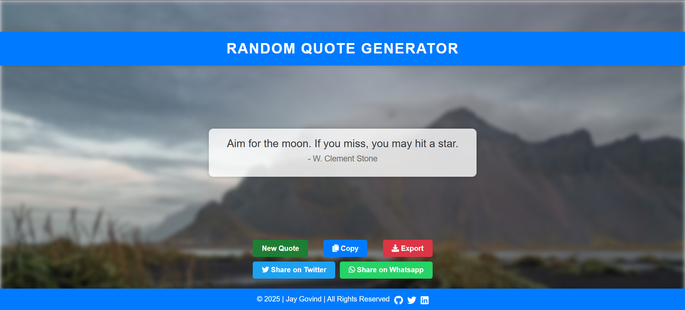

# Random Quote Generator

**[Live Demo](https://favouritequote.vercel.app/)**

## Overview

The Random Quote Generator is a simple web application that generates random quotes and allows users to save and share their favorite quotes.

## Features

- Generate random quotes.
- Save favorite quotes.
- Share quotes on social media.
- Responsive design for different screen sizes.

## Technologies Used

- **[HTML](https://html.com)**: Structure of the web application.
- **[CSS](https://css.com)**: Styling of the mood tracker.
- **[JavaScript](https://javascript.com)**: Functionality for storing moods, updating the calendar, and handling user interactions.
- **[Vercel](https://vercel.com)**: For hosting the web application.

## Getting Started

To get started with the Mood Tracker, follow these steps:

1. Clone the repository to your local machine.
2. Open the `index.html` file in your preferred web browser.
3. Start logging your moods and exploring the mood tracker.

## Contributing

Contributions are welcome! If you have any suggestions, bug reports, or feature requests, please feel free to open an issue or submit a pull request.

## License

This project is licensed under the [MIT License](LICENSE).
